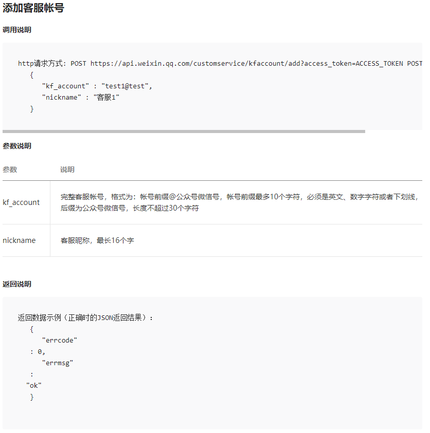

# 如何快速编写一个微信Api？


## 概述
[Magicodes.Wx.Sdk](https://github.com/xin-lai/Magicodes.Wx.Sdk)致力于打造最简洁最易于使用的微信Sdk，逐步包括公众号Sdk、小程序Sdk、企业微信Sdk等，以及Abp VNext集成。

本篇将侧重于讲述如何向[Magicodes.Wx.Sdk](https://github.com/xin-lai/Magicodes.Wx.Sdk)进行贡献。

## WebApiClientCore

[Magicodes.Wx.Sdk](https://github.com/xin-lai/Magicodes.Wx.Sdk)之简洁很大层面依托于NCC的开源库[WebApiClientCore](https://github.com/dotnetcore/WebApiClient)。

开源库地址：https://github.com/dotnetcore/WebApiClient

## 快速开始

这里我们以【客服消息】【添加客服账号】为例进行讲解，官方接口文档地址为：https://developers.weixin.qq.com/doc/offiaccount/Customer_Service/Customer_Service_Management.html#2。



主体步骤如下：

### 1）添加接口IKfAccountApi

参考代码如下所示：

```csharp
/// <summary>
/// 客服管理
/// </summary>
[HttpHost("https://api.weixin.qq.com/customservice/kfaccount/")]
public interface IKfAccountApi : IWxApiWithAccessTokenFilter
{
    /// <summary>
    /// 添加客服账号
    /// </summary>
    /// <param name="input"></param>
    /// <returns></returns>
    [HttpPost("add")]
    Task<ApiResultBase> AddAsync(AddOrUpdateKfAccountInput input);

    /// <summary>
    /// 设置客服信息
    /// </summary>
    /// <param name="input"></param>
    /// <returns></returns>
    [HttpPost("update")]
    Task<ApiResultBase> UpdateAsync(AddOrUpdateKfAccountInput input);

    /// <summary>
    /// 删除客服账号
    /// </summary>
    /// <param name="input"></param>
    /// <returns></returns>
    [HttpPost("del")]
    Task<ApiResultBase> DelAsync(DelKfAccountInput input);
}
```
如上述代码所示，有几个注意事项：

1. 需要定义接口

2. 继承自IWxApiWithAccessTokenFilter接口将自动在接口请求启用AccessTokenApiFilter筛选器，即会自动会在接口请求时带上access_token。

3. HttpHost用于定义接口跟地址

4. HttpPost用于设置接口请求方法，常用特性有：

   | 特性名称                | 功能描述                     | 备注                     |
   | ----------------------- | ---------------------------- | ------------------------ |
   | HttpHostAttribute       | 请求服务http绝对完整主机域名 | 优先级比Options配置低    |
   | HttpGetAttribute        | 声明Get请求方法与路径        | 支持null、绝对或相对路径 |
   | HttpPostAttribute       | 声明Post请求方法与路径       | 支持null、绝对或相对路径 |
   | HttpPutAttribute        | 声明Put请求方法与路径        | 支持null、绝对或相对路径 |
   | HttpDeleteAttribute     | 声明Delete请求方法与路径     | 支持null、绝对或相对路径 |
   | *HeaderAttribute*       | 声明请求头                   | 常量值                   |
   | *TimeoutAttribute*      | 声明超时时间                 | 常量值                   |
   | *FormFieldAttribute*    | 声明Form表单字段与值         | 常量键和值               |
   | *FormDataTextAttribute* | 声明FormData表单字段与值     | 常量键和值               |

### 2）添加Dto

这一步是非必要的，需要看参数的具体内容和要求。添加客服接口的输入参数代码参考如下：

```csharp
    public class AddOrUpdateKfAccountInput
    {
        /// <summary>
        /// 完整客服帐号，格式为：帐号前缀@公众号微信号，帐号前缀最多10个字符，必须是英文、数字字符或者下划线，后缀为公众号微信号，长度不超过30个字符
        /// </summary>
        [JsonProperty("kf_account")]
        [StringLength(30, MinimumLength = 3)]
        [Required]
        public string Account { get; set; }

        /// <summary>
        /// 客服昵称，最长16个字
        /// </summary>
        [JsonProperty("nickname")]
        [StringLength(16, MinimumLength = 1)]
        public string Nickname { get; set; }
    }
```
### 3）添加ApiResultBase

框架中封装了默认的返回结果基类，如果没有其他额外的返回内容，仅需返回`ApiResultBase`即可。如果有额外的范围内容，则需要定义子类继承自`ApiResultBase`，在可能的情况下，有可能需要重写部分方法。如下述代码：

```csharp
public class TokenApiResult : ApiResultBase
{
    /// <summary>
    ///     获取到的凭证
    /// </summary>
    [JsonProperty("access_token")]
    public string AccessToken { get; set; }

    /// <summary>
    ///     凭证有效时间，单位：秒
    /// </summary>
    [JsonProperty("expires_in")]
    internal int Expires { get; set; }

    /// <summary>
    ///     凭证过期时间
    /// </summary>
    public DateTime ExpiresTime { get; set; }
}
```
至此，一个接口就编写完成了。只需要定义interface和Dto就可以了。是不是非常简单？

### 4）单元测试编写

```csharp
/// <summary>
/// 模板消息单元测试
/// </summary>
public class TemplateApiTest : TestBase, IClassFixture<TestWebApplicationFactory>
{
    private readonly ITemplateApi templateApi;
    public TemplateApiTest(TestWebApplicationFactory webApplicationFactory, ITestOutputHelper output) : base(webApplicationFactory, output)
    {
        //通过父类的GetRequiredService获取到Api
        templateApi = GetRequiredService<ITemplateApi>();
    }

    /// <summary>
    /// 模板消息发送测试
    /// </summary>
    /// <returns></returns>
    [Fact]
    public async Task SendAsync_Test()
    {
        var result = await templateApi.SendAsync(new SendTemplateMessageInput()
        {
            To = "oXELNwzZgamuLS0JrJhVgdelzKyw",
            TemplateId = "riid7aad8OKRQD9Ey6dclWBBkrqZSFDhlpKh0_spGLA",
            Data = new System.Collections.Generic.Dictionary<string, TemplateDataItem>()
            {
                {"first",new TemplateDataItem("测试") },
                {"keyword1",new TemplateDataItem("雪雁") },
                {"keyword2",new TemplateDataItem("2021.2.5") },
                {"remark",new TemplateDataItem("备注") },
            }
        });
        //判断Api是否调用成功，未成功将抛出异常WxSdkException
        result.EnsureSuccess();
    }
}
```
整体参考：

https://github.com/xin-lai/Magicodes.Wx.Sdk/pull/1/commits/85263ed9a807581f7315a90fe6e00c51c994d386

## 其他

### IWxApiWithAccessTokenFilter接口

参考代码：

```csharp
/// <summary>
/// 
/// </summary>
[JsonNetReturn(EnsureMatchAcceptContentType = false)]
[AccessTokenApiFilter]
//[LoggingFilter]
public interface IWxApiWithAccessTokenFilter
{
}
```
### AccessTokenApiFilter筛选器

参考代码：

```csharp
public class AccessTokenApiFilter : ApiFilterAttribute
{
    public override async Task OnRequestAsync(ApiRequestContext context)
    {
        ITokenManager tokenManager = context.HttpContext.ServiceProvider.GetRequiredService<ITokenManager>();
        string accessToken = await tokenManager.GetAccessTokenAsync();
        context.HttpContext.RequestMessage.AddUrlQuery("access_token", accessToken);
    }

    public override Task OnResponseAsync(ApiResponseContext context)
    {
        return Task.CompletedTask;
    }
}
```
### 关于ApiResultBase

```csharp
/// <summary>
///     API请求结果
///     {"errcode":40164,"errmsg":"invalid ip 218.76.8.29 ipv6 ::ffff:218.76.8.29, not in whitelist rid: 60122c35-705c3134-51b45a3d"}
/// </summary>
public class ApiResultBase
{
    /// <summary>
    ///     返回码
    /// </summary>
    [JsonProperty("errcode")]
    public virtual ReturnCodes ReturnCode { get; set; }

    /// <summary>
    ///     错误消息
    /// </summary>
    [JsonProperty("errmsg")]
    public virtual string Message { get; set; }

    /// <summary>
    ///     是否为成功返回
    /// </summary>
    /// <returns></returns>
    public virtual bool IsSuccess()
    {
        return ReturnCode == ReturnCodes.请求成功;
    }

    /// <summary>
    ///     获取友好提示
    /// </summary>
    /// <returns></returns>
    public virtual string GetFriendlyMessage()
    {
        return ReturnCode.ToString();
    }
}
```
## 联系我们

### 订阅号
关注“**麦扣聊技术**”订阅号可以获得最新文章、教程、文档，并且加入微信生态群：


### QQ群

- **编程交流群<85318032>**（由于不经常在线，为了避免骚扰，设置了一定门槛）


#### 文档官网&官方博客

- **文档官网：<https://docs.xin-lai.com/>**
- **博客：<http://www.cnblogs.com/codelove/>**

#### 其他开源库

- **<https://github.com/xin-lai>**
- **<https://gitee.com/magicodes>**
